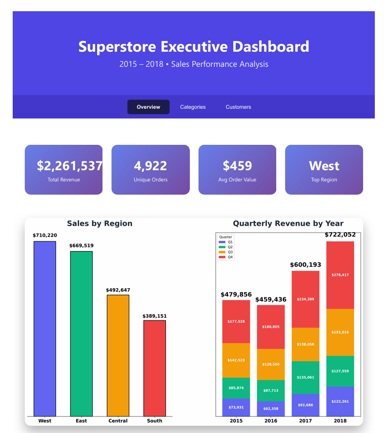

# Superstore Sales Executive Dashboard (2015–2018)

**Interactive 3-page executive dashboard** built entirely in Python — no Power BI, no paid tools.



**[Open Live Dashboard](https://villawolvesh.github.io/superstore-executive-dashboard/)**

## Business Value
- Identifies top-performing regions and customer segments
- Reveals quarterly trends and seasonal patterns
- Highlights best and worst performing product categories
- Enables data-driven decisions on promotions and inventory

## Dashboard Pages
| Tab           | Key Insights                                      |
|---------------|---------------------------------------------------|
| Overview      | Revenue KPIs, regional performance, quarterly trend with yearly totals |
| Categories    | Sales by category + Top 10 sub-categories         |
| Customers     | Customer segment share + Top 10 customers by revenue |

## Key Findings
- **West region** consistently leads in sales
- **Q4** shows strongest performance across all years
- **Phones, Binders, and Paper** drive majority of volume
- **Corporate segment** has highest average order value

## Technical Implementation
- Python (`pandas` for analysis, `matplotlib` for visualization)
- Single HTML file output with interactive tabs
- Zero external dependencies beyond standard libraries

## How to Run Locally
```bash
pip install pandas matplotlib
python superstore_dashboard.py
